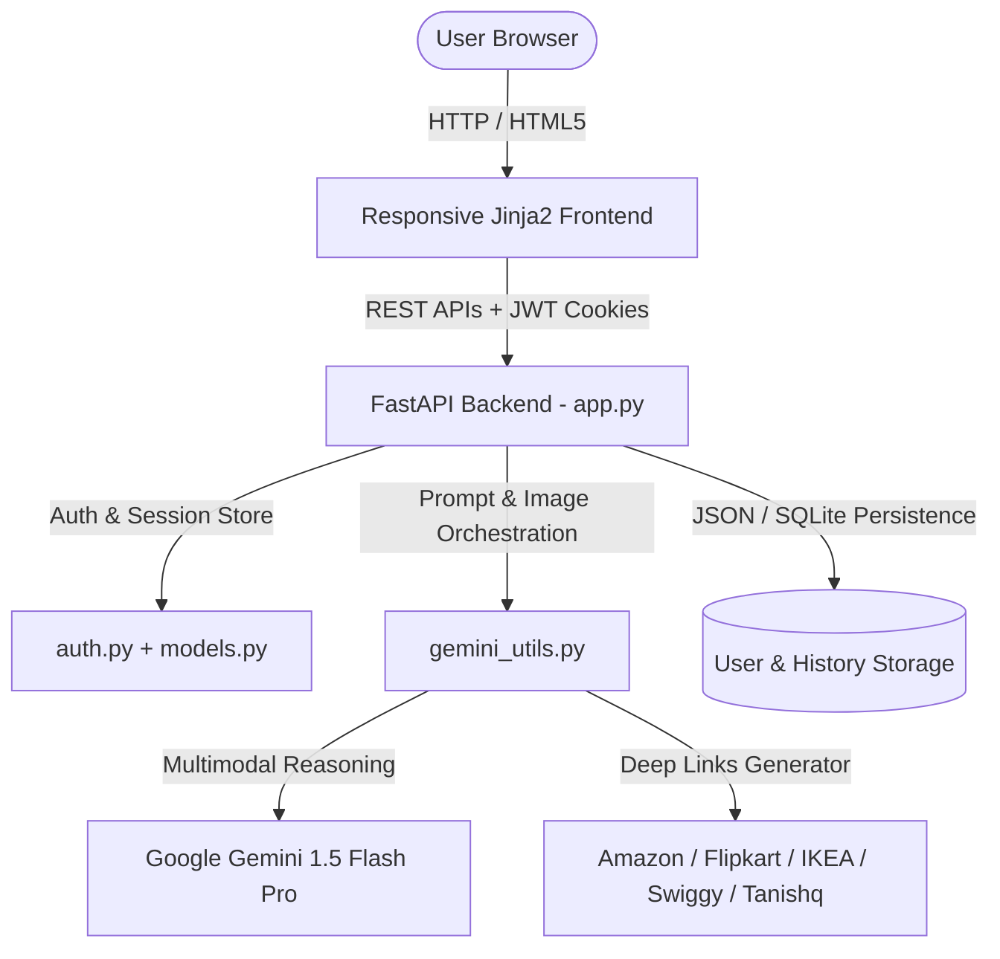

# PocketSmart AI: Your Smart Budget & Recommendation Assistant 🛍️💡✨

**PocketSmart AI** is a Generative AI-powered, cross-platform recommendation and budgeting platform. It analyzes user preferences, budgets, and multimodal inputs (text, numbers, and outfit images) using **Google Gemini 1.5 Flash Pro** to generate personalized, budget-conscious product & service recommendations from top platforms including **Amazon India, Flipkart, IKEA, Swiggy, Zomato, BookMyShow, MakeMyTrip, OYO Rooms, Tanishq, BlueStone, CaratLane, and Melorra**.

---

## 🏗️ Architecture & Features



### 🎯 Core Planners
1. **🏠 Home Interior Budget Planner**
   - Allocates budget across room types (Living Room, Kitchen, Bedroom).
   - Generates quantities and items for lighting fixtures, ceiling fans, furniture, and dining sets.
   - Computes real-time budget utilization percentages with direct shopping links (Amazon, Flipkart, IKEA, Myntra, Ajio).

2. **🎉 Party Budget Planner**
   - Allocates proportional budgets for Venue, Catering, Decorations, Entertainment, and Contingency buffers.
   - Considers guest counts and occasion types (Birthday, Wedding, Anniversary, Corporate).
   - Generates links for Swiggy/Zomato bulk catering, BookMyShow, MakeMyTrip, OYO Rooms, and NoBroker venue bookings.

3. **💎 Jewelry Budget Planner (Multimodal Text + Vision)**
   - Recommends style-coordinated jewelry (Necklaces, Jhumkas, Bangles, Rings, Watches).
   - Supports uploading outfit photos: Gemini Vision performs color harmony, style, and formality analysis.
   - Provides verified shopping links on Tanishq, CaratLane, BlueStone, Melorra, Meesho, and Amazon.

4. **📜 Recommendation History & User Dashboard**
   - User authentication (JWT tokens, password hashing, active sessions).
   - Past budget plans saved with full itemized breakdown and one-click detailed modal reviews.

---

## 📁 Project Directory Structure

```
PocketSmart_AI/
├── .env                          # Environment variables (API keys & JWT config)
├── .env.example                  # Environment template
├── requirements.txt              # Python dependencies
├── README.md                     # Documentation & setup guide
├── app.py                        # FastAPI main application & routing
├── gemini_utils.py               # AI prompt orchestration & platform links
├── auth.py                       # User auth, JWT token, & history persistence
├── models.py                     # Pydantic data schemas
├── test_app.py                   # Automated integration test suite
├── static/
│   ├── styles.css                # Modern responsive UI theme & card styling
│   └── uploads/                  # Uploaded outfit images for vision analysis
├── templates/
│   ├── base.html                 # Navigation bar, spinner, footer layout
│   ├── index.html                # Landing page with hero & testimonials
│   ├── login.html                # Login page
│   ├── register.html             # Registration page
│   ├── dashboard.html            # User dashboard with planner cards & recent logs
│   ├── home_planner.html         # Home interior budget planner & results view
│   ├── party_planner.html        # Party budget planner & results view
│   ├── jewelry_planner.html      # Multimodal jewelry planner & results view
│   └── history.html              # Full recommendation history & details modal
└── data/
    ├── users.json                # Saved user credentials
    └── history.json              # Saved recommendation histories
```

---

## 🚀 Quickstart & VS Code Setup

### Prerequisites
- Python 3.9+ installed on your system.
- VS Code (Visual Studio Code).
- Google Gemini API Key (Optional: get one from [Google AI Studio](https://aistudio.google.com/)). The system includes an intelligent fallback engine if an API key is not supplied.

### Step 1: Clone / Open the Project in VS Code
Open VS Code, press `Ctrl + O` (or `File -> Open Folder...`), and select the `PocketSmart_AI` folder.

### Step 2: Create a Python Virtual Environment
Open the integrated terminal in VS Code (`Ctrl + ~`) and run:

**On Windows (PowerShell):**
```powershell
python -m venv venv
.\venv\Scripts\Activate.ps1
```

**On macOS / Linux:**
```bash
python3 -m venv venv
source venv/bin/activate
```

### Step 3: Install Dependencies
```bash
pip install -r requirements.txt
```

### Step 4: Configure Environment Variables
Copy `.env.example` to `.env` (or edit the existing `.env`):
```ini
GOOGLE_API_KEY=your_actual_gemini_api_key_here
SECRET_KEY=pocketsmart_super_secure_jwt_secret_key_2025_prod
ALGORITHM=HS256
ACCESS_TOKEN_EXPIRE_MINUTES=60
HOST=0.0.0.0
PORT=8000
```

### Step 5: Run the Application
Run the FastAPI application using Python or Uvicorn:
```bash
python app.py
```
*Or:*
```bash
uvicorn app:app --reload --host 0.0.0.0 --port 8000
```

Open your browser and navigate to:
👉 **[http://localhost:8000](http://localhost:8000)**

---

## 🧪 Running Automated Tests

To run the complete test suite verifying all 8 endpoints and recommendation flows:
```bash
python test_app.py
```
*Or using pytest:*
```bash
pytest test_app.py -v
```

---

## 🔌 API Endpoints Reference

| Method | Endpoint | Description |
|---|---|---|
| `GET` | `/` | Public landing page |
| `GET` | `/login` / `/register` | Authentication pages |
| `POST` | `/register` | Create a new user account |
| `POST` | `/login` or `/token` | Authenticate user & issue JWT cookie |
| `POST` | `/logout` | Terminate session & blacklist token |
| `GET` | `/dashboard` | User dashboard & recent activity |
| `GET` | `/home-planner` | Home interior budget planner interface |
| `POST` | `/home-budget` | Generate AI home interior recommendations |
| `GET` | `/party-planner` | Party budget planner interface |
| `POST` | `/party-budget` | Generate AI party recommendations & allocations |
| `GET` | `/jewelry-planner` | Multimodal jewelry budget planner interface |
| `POST` | `/jewelry-budget` | Generate AI jewelry recommendations with outfit image |
| `GET` | `/history` | Full recommendation history page |
| `GET` | `/recommendation-history` | JSON array of past recommendations |
| `GET` | `/recommendation-details/{id}` | Detailed JSON item breakdown of a past plan |
| `GET` | `/session-info` | Current session metadata & uptime |
| `POST` | `/session-data` | Update active session state |
